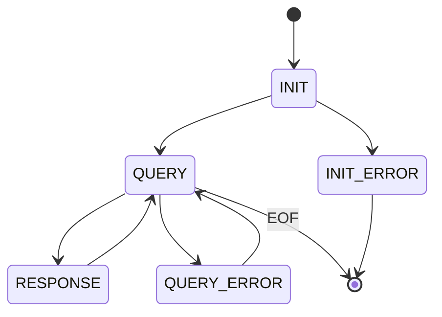

# Protocol

## State Diagram

## Syntax

- based on html-like tag, through std::cout
- the information **outside** the tag is invalid
    - some internal log
    - uncaught exception
- only the tag in a separate line is valid
- `<init>` `</init>`
    - some init message, like load time
- `<initerror>` `</initerror>`
- `<queryerror>` `</queryerror>`
- `<queryresult>` `</queryresult>`
    - for response
